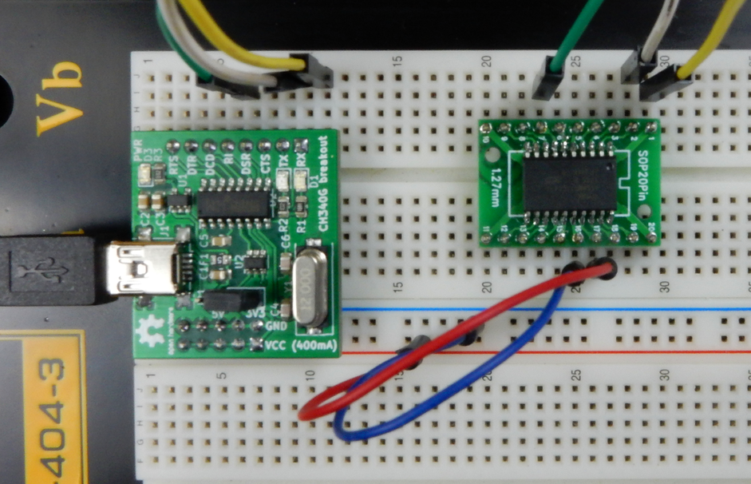
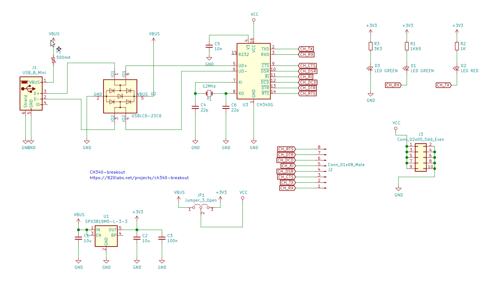
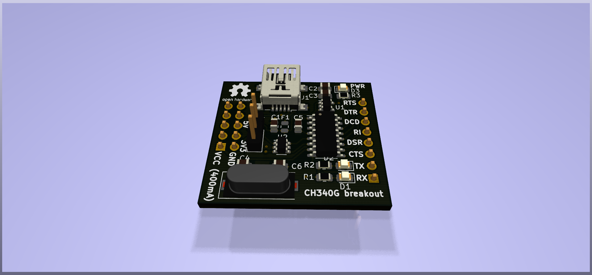
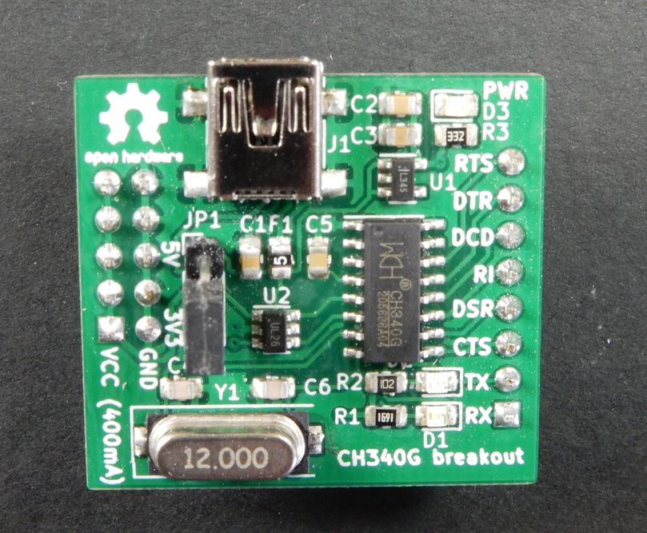

This a simple CH340G breakout board design, for using (mainly) on breadboards. There are a dozen of good designs out 
there, but this one tries to differentiate itself by being breadboard-friendly (meaning it’s possible to plug it into 
your board without sticking out vertically), provides (fused) power supply directly to the power rails of the breadboard 
(selectable 5V or 3V3), and it exposes all of the modem control lines.

 I decided to design this when I was starting prototyping an other project, and wished I had something similar. After a 
 quick, unsuccessful query on Tindie (this is something similar, but not designed for breadboard, and not OSHW), the 
 next thing I noticed was that I have Kicad open and I’m laying out this board. It’s nothing groundbreaking, but as you 
 can see on the pictures, it’s directly pluggable into breadboard, and it can also power your breadboard circuit from 
 the USB port, so I’m sure it can come handy sometimes to everyone on Earth. The schematic is pretty much the default 
 design for the CH340G chip, plus there is some ESD protection on the USB line (USBLC6-2SC6), a 3.3V regulator with 
 jumpers to select the output VCC and the UART line voltage and of course some LEDs for power and the TX/RX lines, as 
 blinking LEDs are mandatory for any reasonable gadget.

The PCB is designed with Kicad, it’s double sided, but possible to build it on single-sided board as well. You can find 
all of the CAD files in this repo, but  here is a teaser:

The usage it’s pretty straightforward: just plug it into your breadboard, connect the UART lines to your circuit, select 
the operating voltage, and connect the USB cable to your PC. If you are using any {r,d}ecent Linux distribution, the 
CH340G driver most likely is installed on your machine. If you are on Windows, you have to click around a bit, see for 
example the tutorial at Sparkfun 

Bookmarks
---------

http://nicecircuits.com/ch340g-usb-to-rs232-ttl-module-schematic-d-sun-v3-0/

https://www.tindie.com/products/bitluni/cam-prog/?utm_source=hackaday&utm_medium=link&utm_campaign=fromstore#specs
